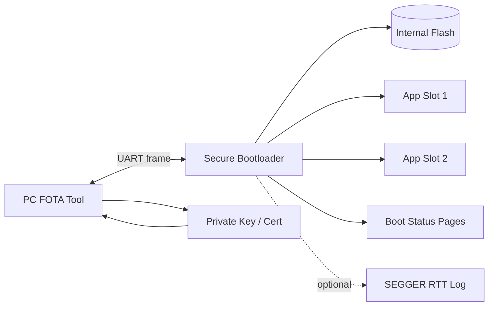
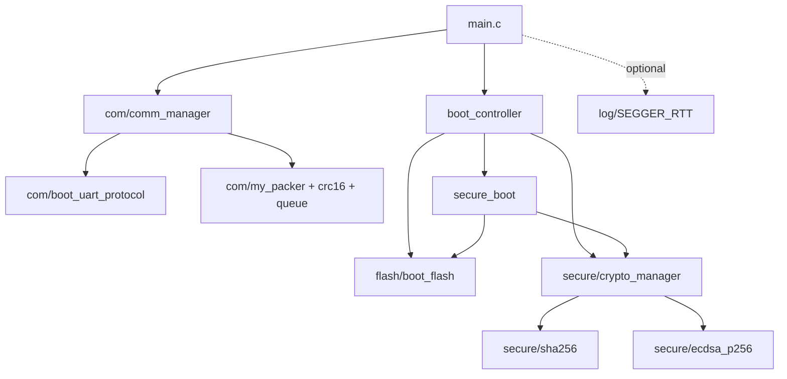
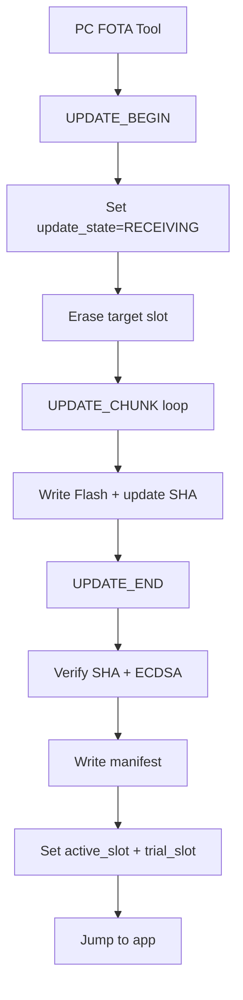
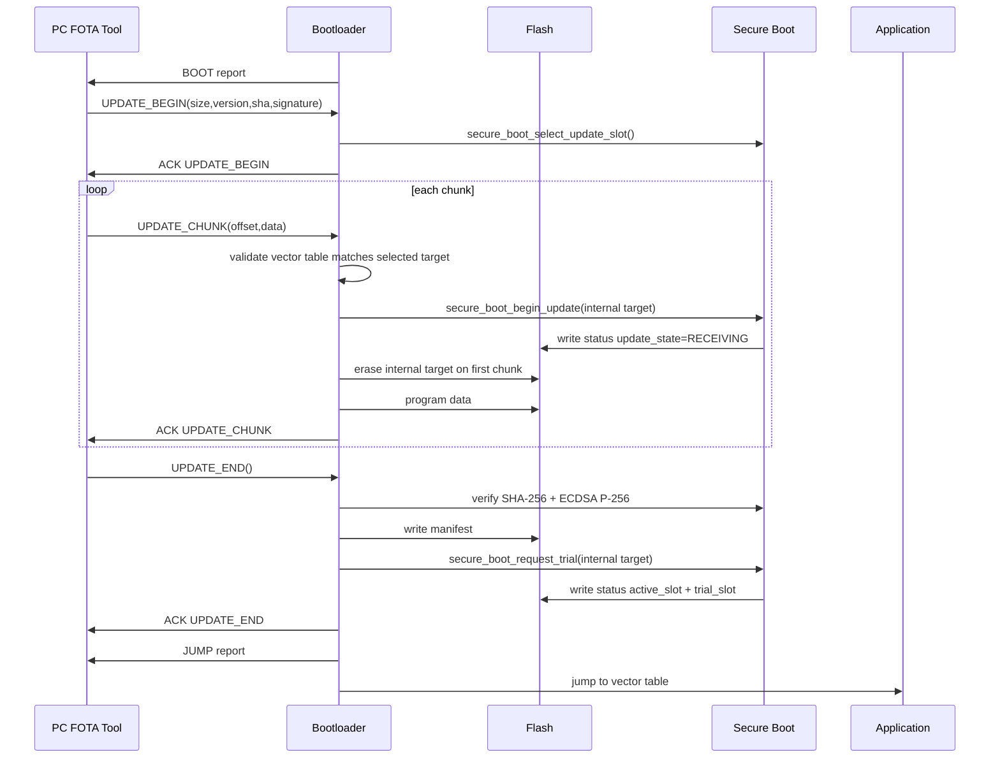
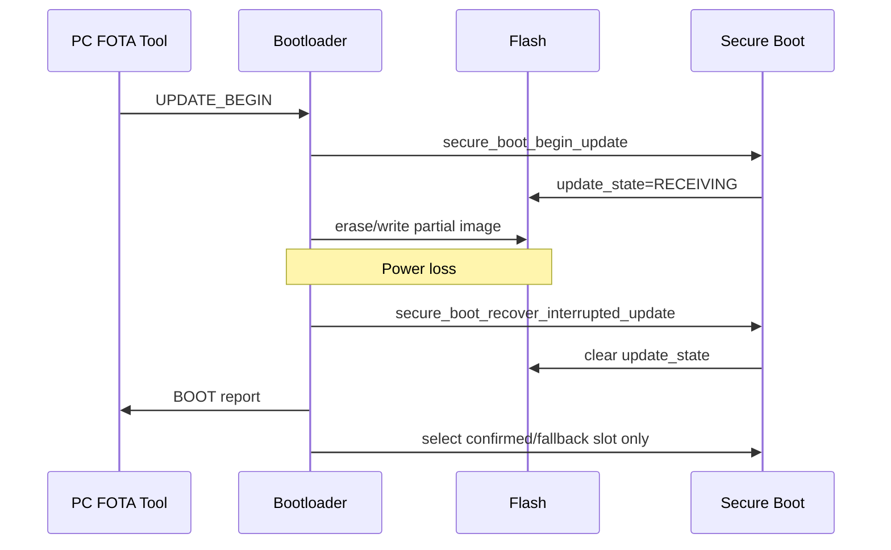
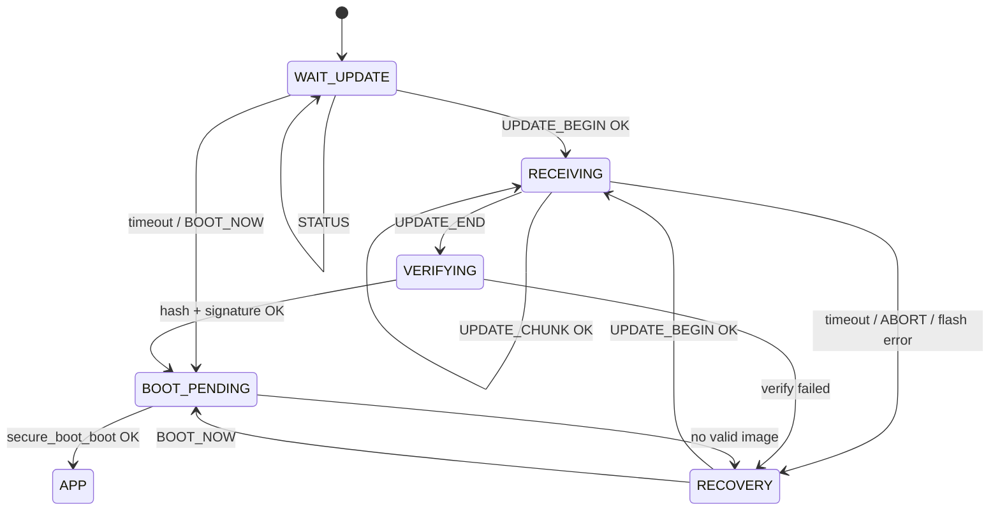

# STM32F103 Secure Boot Firmware

This README documents the STM32F103C8T6 bootloader firmware. The bootloader
authenticates application firmware with SHA-256 and ECDSA P-256, receives FOTA
updates over UART, survives power loss during an update, supports trial/confirmed
slot rollback, and jumps only to a valid application image.

The PC FOTA tool in `script/` is a host-side helper for key generation,
firmware signing, and UART transfer. The architecture below focuses on the
firmware running on the MCU.

## Requirements

### Hardware

| Item         | Requirement                                            |
| ------------ | ------------------------------------------------------ |
| MCU          | STM32F103C8T6, 64 KiB Flash, 20 KiB RAM                |
| UART         | USART1, default 115200 8N1                             |
| Flash page   | 1 KiB/page                                             |
| Debug/log    | UART reports and rate-limited SEGGER RTT event logging |
| Host adapter | USB-UART adapter; DTR/RTS optional for automatic reset |

### Firmware/toolchain

| Item         | Requirement                                |
| ------------ | ------------------------------------------ |
| Build system | CMake >= 3.22, Ninja                       |
| Compiler     | arm-none-eabi GCC                          |
| HAL          | STM32F1 HAL/CMSIS generated by STM32CubeMX |
| Language     | C11                                        |

### Host tool for firmware update

```powershell
python -m pip install -r script\requirements.txt
python script\fota_uart_tool.py
```

Main dependencies:

- `cryptography`: key/cert generation and ECDSA P-256 signing.
- `pyserial`: UART communication.
- `tkinter`: Python GUI toolkit, usually included with Python installers.

### Secure boot System requirements

The secure bootloader is the MCU root of trust. It must authenticate every
application image before execution, preserve a known-good image during updates,
and reject rollback to older firmware.

Core requirements:

1. Every application firmware image must be signed offline by the release
   private key using ECDSA P-256.
2. The private key must never be stored on the target device. The bootloader
   stores only the production public key, or the hash of a root public key when a
   certificate chain is used.
3. The bootloader must verify the application SHA-256 digest and the ECDSA P-256
   manifest signature before jumping to an application slot.
4. The bootloader must never jump to an unsigned image, an image with a bad
   hash, an image with an invalid signature, an unsupported manifest format, or
   an invalid vector table.
5. The Flash layout must provide two application slots, App1 and App2, so a new
   firmware image can be installed without destroying the last bootable image.
6. The bootloader must maintain persistent boot status with redundant Flash
   records, generation counters, and CRC so boot state can survive reset or
   power loss.
7. During FOTA, the bootloader must mark `update_state=RECEIVING` before slot
   erase/write starts. If power is lost before the update is committed, the next
   boot clears the update marker and refuses to boot the partially written slot.
8. A slot becomes bootable only after the full image is received, the streamed
   SHA-256 matches the manifest hash, the manifest signature verifies, and the
   manifest is written successfully.
9. A newly installed image must enter trial state first. It becomes permanent
   only after the running application confirms itself with
   `secure_boot_confirm_running_image(slot)`.
10. If a trial image is not confirmed within the allowed trial boot count, the
    bootloader must roll back to the confirmed slot or another valid fallback
    image.
11. The bootloader must enforce anti-rollback with a monotonic
    `image_version`. Images older than `minimum_version` must be rejected.
12. The bootloader region and provisioned public key must be protected against
    field modification, for example with STM32 option-byte write protection and
    an appropriate readout/debug-port policy. This prevents an attacker from
    replacing the verifier, replacing the public key, or bypassing signature
    checks.
13. UART FOTA packets must be framed and integrity-checked by the transport
    protocol. The current implementation authenticates the installed firmware
    before boot but does not encrypt UART payloads; production deployments that
    require firmware confidentiality should add encrypted transport, such as an
    authenticated session using AES-GCM.

Manifest/header requirements:

- The firmware image and the secure boot manifest are separate objects in Flash.
  The application is linked at the start of the selected slot; the manifest is
  stored in the final 256 bytes of that slot.
- The manifest contains `magic`, `format_version`, `signed_size`, `image_size`,
  `image_version`, `image_flags`, `image_sha256`, `signature`, and reserved
  padding.
- `magic` identifies the structure as a secure boot manifest and prevents random
  Flash contents or the wrong structure type from being parsed as valid
  metadata.
- `format_version` allows future manifest changes while letting old bootloaders
  reject unsupported formats safely.
- `signed_size` defines the exact manifest byte range covered by the signature.
  In the current format, the signed region is the first 52 bytes, from `magic`
  through `image_sha256`.
- `image_size` limits the hashed and bootable image region and must fit inside
  the slot before the manifest area.
- `image_version` is used for anti-rollback.
- `image_sha256` is the SHA-256 digest of exactly `image_size` bytes starting at
  the slot base.
- `signature` is a raw ECDSA P-256 signature in `r || s` format over the SHA-256
  digest of the signed manifest region.

Update target ownership:

- The PC FOTA tool does not send, choose, validate, or display a Flash slot.
- The bootloader selects the inactive Flash slot from persistent boot status:
  if no active image can be identified it selects APP1; otherwise it selects
  the opposite slot from `active_slot`.
- The first `UPDATE_CHUNK` must still contain a vector table linked for the
  selected target slot. A firmware image linked for APP1 is rejected when the
  selected target is APP2, and vice versa.
- After a received image is verified and accepted as a trial image,
  `active_slot` is updated to that slot so the next FOTA writes the opposite
  slot.

## Firmware System Architecture



The bootloader firmware is responsible for:

- Reporting bootloader entry over UART.
- Receiving new firmware over UART.
- Selecting the inactive internal Flash slot from persistent boot status.
- Validating that the incoming firmware vector table matches the selected slot.
- Writing firmware to that internal region.
- Verifying the firmware SHA-256 hash.
- Verifying the ECDSA P-256 manifest signature.
- Writing the manifest only after successful verification.
- Selecting a valid image to boot.
- Rolling back if a trial image is not confirmed.

The application firmware is responsible for:

- Linking at the correct slot base address.
- Calling `secure_boot_confirm_running_image(slot)` after a successful trial
  boot, or using the confirm command in controlled debug/test flows.

## Flash Partition

The STM32F103C8T6 has 64 KiB of internal Flash. Current layout:

| Region | Address range               |   Size | Purpose                             |
| ------ | --------------------------- | -----: | ----------------------------------- |
| Boot   | `0x08000000` - `0x08009FFF` | 40 KiB | Secure bootloader                   |
| App1   | `0x0800A000` - `0x0800C7FF` | 10 KiB | Application slot 1                  |
| App2   | `0x0800C800` - `0x0800EFFF` | 10 KiB | Application slot 2                  |
| Data   | `0x0800F000` - `0x0800FFFF` |  4 KiB | Boot status and persistent metadata |

Each application slot reserves its last 256 bytes for
`secure_boot_manifest_t`, so the maximum signed image size is
`10 KiB - 256 B = 9984 B`.

The first two pages in the Data region store redundant boot status records:

- `BOOT_STATUS_PRIMARY_ADDRESS = 0x0800F000`
- `BOOT_STATUS_BACKUP_ADDRESS  = 0x0800F400`

The bootloader writes these records alternately using `generation + crc32`.
This reduces the risk of losing boot state if power fails during a status write.

## Firmware Memory Partition

### Internal Flash map

```text
STM32F103C8T6 Flash: 64 KiB, base 0x08000000, page size 1 KiB

0x08000000  +-------------------------------+
            | Bootloader                    | 40 KiB
0x08009FFF  +-------------------------------+
0x0800A000  | App1 image                    |
            |                               |
0x0800C700  | App1 manifest                 | 256 B
0x0800C7FF  +-------------------------------+ 10 KiB total
0x0800C800  | App2 image                    |
            |                               |
0x0800EF00  | App2 manifest                 | 256 B
0x0800EFFF  +-------------------------------+ 10 KiB total
0x0800F000  | Status primary page           | 1 KiB
0x0800F400  | Status backup page            | 1 KiB
0x0800F800  | Reserved persistent data      |
0x0800FFFF  +-------------------------------+ 4 KiB total
```

| Symbol                              | Address / Size | Description                      |
| ----------------------------------- | -------------: | -------------------------------- |
| `BOOT_FLASH_BASE`                   |   `0x08000000` | Flash base                       |
| `BOOT_FLASH_SIZE`                   |       `40 KiB` | Bootloader reserved size         |
| `BOOT_APP1_BASE`                    |   `0x0800A000` | App1 vector table address        |
| `BOOT_APP2_BASE`                    |   `0x0800C800` | App2 vector table address        |
| `BOOT_APP_SLOT_SIZE`                |       `10 KiB` | Total size per app slot          |
| `SECURE_BOOT_MANIFEST_SIZE`         |        `256 B` | Manifest at the end of each slot |
| `secure_boot_slot_max_image_size()` |       `9984 B` | Maximum signed app image size    |
| `BOOT_DATA_BASE`                    |   `0x0800F000` | Boot persistent data region      |
| `BOOT_STATUS_PRIMARY_ADDRESS`       |   `0x0800F000` | Primary boot status page         |
| `BOOT_STATUS_BACKUP_ADDRESS`        |   `0x0800F400` | Backup boot status page          |

### Firmware slot layout

Each application slot contains image bytes followed by a manifest:

```text
slot_base
  +0x0000                         application vector table
  +0x0004                         reset handler
  +...                            application code/data in Flash
  +(BOOT_APP_SLOT_SIZE - 256)     secure_boot_manifest_t
```

Manifest fields:

| Field            |  Size | Purpose                                           |
| ---------------- | ----: | ------------------------------------------------- |
| `magic`          |   4 B | Must be `SECURE_BOOT_MANIFEST_MAGIC`              |
| `format_version` |   2 B | Manifest format version                           |
| `signed_size`    |   2 B | Number of manifest bytes covered by the signature |
| `image_size`     |   4 B | Exact firmware byte count from slot base          |
| `image_version`  |   4 B | Anti-rollback version                             |
| `image_flags`    |   4 B | Reserved flags                                    |
| `image_sha256`   |  32 B | SHA-256 of the firmware image                     |
| `signature`      |  64 B | ECDSA P-256 raw `r                                |  | s` |
| `reserved`       | 140 B | Reserved, filled before manifest write            |

Only the first 52 bytes are signed. The signature field itself is not included
in the signed region.

### Firmware persistent status layout

`secure_boot_status_t` is stored twice, once in the primary page and once in the
backup page. The bootloader selects the valid record with the highest
`generation`.

| Field              | Purpose                                             |
| ------------------ | --------------------------------------------------- |
| `generation`       | Monotonic status generation counter                 |
| `active_slot`      | Slot treated as active for the next FOTA decision   |
| `confirmed_slot`   | Last application confirmed as healthy               |
| `trial_slot`       | Candidate application allowed to boot once          |
| `trial_boot_count` | Trial boot counter                                  |
| `minimum_version`  | Minimum accepted version for anti-rollback          |
| `update_slot`      | Slot currently being updated                        |
| `update_state`     | `IDLE` or `RECEIVING`, used for power-loss recovery |
| `crc32`            | Integrity check for the status record               |

Power-loss behavior:

- If power fails while writing status, the other status page should still be
  valid.
- If power fails while writing application data, `update_state=RECEIVING` is
  cleared on the next boot. The partially written slot is not bootable because
  its manifest is missing or invalid.
- A slot becomes bootable only after image hash verification, manifest signature
  verification, and manifest Flash write all succeed.

### Firmware RAM map

STM32F103C8T6 SRAM:

| Symbol          | Address / Size | Description |
| --------------- | -------------: | ----------- |
| `BOOT_RAM_BASE` |   `0x20000000` | SRAM base   |
| `BOOT_RAM_SIZE` |       `20 KiB` | Total SRAM  |
| `BOOT_RAM_END`  |   `0x20005000` | SRAM end    |

Before jumping, the bootloader validates the application vector table:

- Initial MSP must be inside `0x20000000 .. 0x20005000`.
- Reset handler must be a Thumb address and must point inside the selected
  application image range.
- Before the jump, the bootloader disables interrupts, stops SysTick, clears
  pending NVIC interrupts, sets `SCB->VTOR` to the application slot base, sets
  MSP, and calls the application reset handler.

## Firmware Software Architecture



Main layers:

| Layer              | Files                                    | Responsibility                                                     |
| ------------------ | ---------------------------------------- | ------------------------------------------------------------------ |
| Board entry        | `Core/Src/main.c`                        | HAL init, UART ISR callbacks, main loop                            |
| Boot orchestration | `boot_controller.*`                      | State machine, FOTA flow, UART reports, jump scheduling            |
| Secure boot policy | `secure_boot.*`                          | Slot verification, trial/confirmed state, rollback, boot selection |
| Flash access       | `flash/boot_flash.*`                     | Slot erase, streamed image write, manifest/status writes           |
| Crypto manager     | `secure/crypto_manager.*`                | Constant-time compare, secure zero, signature helper               |
| Crypto primitives  | `secure/sha256.*`, `secure/ecdsa_p256.*` | SHA-256 and ECDSA P-256 verification                               |
| Communication      | `com/*`                                  | UART frame, queue, packer, command/report protocol                 |
| Log                | `log/*`                                  | SEGGER RTT event logging without printf formatting                 |
| Host tool          | `script/fota_uart_tool.py`               | Key generation, firmware signing, UART transfer                    |

## Communication Architecture

UART payloads are framed by the packer:

```text
+--------+----------+---------+---------+--------+------+
| 0xAC   | len[15:8]| len[7:0]| payload | CRC16  | 0xBB |
+--------+----------+---------+---------+--------+------+
```

CRC is CRC-16/MCRF4XX over `len_hi`, `len_lo`, and `payload`.

### Commands

| Command        |  Value | Payload                                                               |
| -------------- | -----: | --------------------------------------------------------------------- |
| `STATUS`       | `0x01` | `[cmd]`                                                               |
| `BOOT_NOW`     | `0x03` | `[cmd]`                                                               |
| `RESET`        | `0x04` | `[cmd]`                                                               |
| `SLOT_INFO`    | `0x05` | `[cmd]`                                                               |
| `UPDATE_BEGIN` | `0x10` | `[cmd, image_size u32, version u32, sha256 32B, signature 64B]`        |
| `UPDATE_CHUNK` | `0x11` | `[cmd, offset u32, data...]`                                          |
| `UPDATE_END`   | `0x12` | `[cmd]`                                                               |
| `UPDATE_ABORT` | `0x13` | `[cmd]`                                                               |

`UPDATE_CHUNK` data is currently limited to 200 bytes. The first chunk must
contain at least the first 8 firmware bytes so the bootloader can inspect the
vector table and confirm it matches the selected target slot before erasing
Flash.

### Reports

| Report   |  Value | Meaning                                       |
| -------- | -----: | --------------------------------------------- |
| `STATUS` | `0x80` | Current status                                |
| `ACK`    | `0x81` | Command succeeded                             |
| `NACK`   | `0x82` | Command failed                                |
| `BOOT`   | `0x83` | Bootloader has entered boot mode              |
| `JUMP`   | `0x84` | Bootloader is about to jump to an application |
| `SLOT_INFO` | `0x85` | APP1/APP2 firmware metadata                |

Report payload is 20 bytes:

```text
[0] report
[1] command
[2] boot_controller_state
[3] secure_boot_result
[4] active_slot
[5] confirmed_slot
[6] trial_slot
[7] update_state
[8..11] received_image_size  little-endian
[12..15] expected_image_size little-endian
[16..19] image_version       little-endian
```

`SLOT_INFO` report payload is 28 bytes:

```text
[0] report = 0x85
[1] command = 0x05
[2] boot_controller_state
[3] secure_boot_result
[4] APP1 secure_boot_result
[5] APP1 valid
[6] APP2 secure_boot_result
[7] APP2 valid
[8..11] APP1 image_size      little-endian
[12..15] APP1 image_version  little-endian
[16..19] APP2 image_size     little-endian
[20..23] APP2 image_version  little-endian
[24..27] minimum_version     little-endian
```

## Module Architecture

### `boot_controller`

Coordinates bootloader runtime behavior:

- Sends the `BOOT` report at startup and every 500 ms while waiting for FOTA.
- Waits 4 seconds for FOTA during `BOOT_STARTUP_TIMEOUT_MS`.
- Receives `UPDATE_BEGIN/CHUNK/END`.
- Calls the Flash writer to write the image.
- Calls crypto helpers to verify hash and signature.
- Calls `secure_boot_request_trial()` after a valid image is installed.
- Sends the `JUMP` report and waits for UART TX idle before jumping.

### `secure_boot`

Owns secure boot policy:

- Verifies the application vector table.
- Computes SHA-256 over the image stored in Flash.
- Verifies the ECDSA P-256 manifest signature.
- Prevents rollback with `minimum_version`.
- Manages `active_slot`, `confirmed_slot`, `trial_slot`, and
  `trial_boot_count`.
- Manages `update_state/update_slot` to detect interrupted updates.

### `boot_flash`

Owns Flash operations:

- Erases an application slot.
- Writes firmware by half-word.
- Handles a trailing odd byte.
- Writes the manifest at the end of the slot.
- Writes primary/backup status pages.

### `crypto_manager`

Owns security-sensitive helper operations:

- Constant-time compare.
- Secure zero of sensitive buffers.
- Public key provisioning check.
- Signed manifest construction and signature verification.

### `com`

Owns UART/FOTA communication:

- `comm_manager`: RX/TX queues and HAL transmit callback integration.
- `my_packer`: UART frame format with start/end/length/CRC.
- `boot_uart_protocol`: command parsing and report construction.

## Data Flow

### Firmware signing

```mermaid
flowchart LR
    FW[app.bin] --> HASH[SHA-256 image]
    HASH --> META[Manifest signed region]
    VERSION[image_version] --> META
    SIZE[image_size] --> META
    KEY[Private ECDSA P-256 key] --> SIGN[Sign manifest signed region]
    META --> SIGN
    SIGN --> SIG[Signature r||s 64B]
    HASH --> BEGIN[UPDATE_BEGIN payload]
    SIG --> BEGIN
```

The manifest signed region is the first 52 bytes of `secure_boot_manifest_t`,
excluding the `signature` field.

### UART FOTA



If power is lost while `update_state=RECEIVING`, the next boot clears the
marker and refuses to boot the partially written slot because its manifest is
not valid.

## Sequence Diagram

### Normal FOTA update



### Power loss during update



## State Machine



Boot result policy:

- A trial image can boot only `SECURE_BOOT_TRIAL_BOOT_LIMIT` times.
- If a trial boot is not confirmed, the next reset clears the trial state and
  boots the confirmed/fallback image.
- `minimum_version` rejects images older than the latest confirmed version.

## Getting Started

### 1. Generate key/cert

```powershell
python script\fota_uart_tool.py gen-key --out-dir script\keys
```

Generated files:

- `secure_boot_p256_private_key.pem`
- `secure_boot_p256_cert.pem`
- `secure_boot_public_key.generated.c`

Copy the generated 64-byte raw public key into:

```text
Core/Src/secure/secure_boot_public_key.c
```

The default public key is all zeros. With that default key, the firmware
intentionally rejects every signed image.

### 2. Build bootloader

```powershell
cmake --preset Debug
cmake --build --preset Debug
```

Flash the bootloader at `0x08000000`.

SEGGER RTT logging is enabled by default, but only for major events and error
paths so FOTA chunks are not slowed by per-frame logs. The firmware does not use
formatted `printf` logging. Disable RTT completely for minimum Flash use:

```powershell
cmake --preset Debug -DBOOT_ENABLE_RTT_LOG=OFF
```

### 3. Build application

The application must link at the start of a slot:

- App1: `0x0800A000`
- App2: `0x0800C800`

The application vector table must be at the slot base. Image size must not
exceed `secure_boot_slot_max_image_size()` (`9984` bytes).

### 4. Sign firmware

```powershell
python script\fota_uart_tool.py sign `
  --firmware app.bin `
  --key script\keys\secure_boot_p256_private_key.pem `
  --version 1 `
  --out app.fota.json
```

Or use the GUI:

```powershell
python script\fota_uart_tool.py
```

### 5. Transfer FOTA over UART

In the GUI:

1. Select the private key.
2. Select the firmware `.bin`.
3. Select version.
4. Select COM port and baudrate.
5. Click `Sign firmware`.
6. Click `Start update`.
7. The tool sends `RESET`, waits for a `BOOT` status report, then transfers the
   signed firmware.
8. After `UPDATE_END` succeeds, the bootloader sends `JUMP` and starts the app.

The GUI also provides `Slot/FW info` to request APP1/APP2 validity, image size,
and firmware version, plus `Reset boot` to send the bootloader reset command.
The same operations are available from CLI:

```powershell
python script\fota_uart_tool.py slot-info --port COM3 --baud 115200
python script\fota_uart_tool.py reset --port COM3 --baud 115200
```

If the application does not handle the `RESET` command and DTR/RTS is not wired
to the reset/boot pins, select reset mode `none` and reset the MCU manually
after clicking `Start update`.

## Security Notes

- The private key must stay on the PC/tool side and must not be stored in
  firmware.
- Firmware stores only the raw ECDSA P-256 public key `X || Y` as 64 bytes.
- Production devices should enable an appropriate readout-protection and debug
  access policy.
- If an attacker can reprogram Flash through an unlocked debugger, secure boot
  alone is not enough to protect the device.
- Never ship a product with the default all-zero public key.

## Improvements
